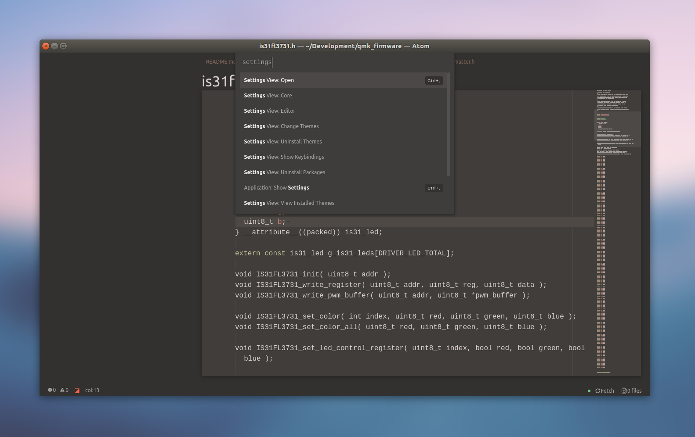
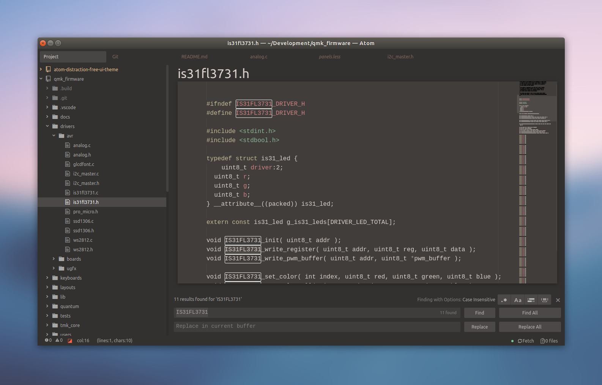
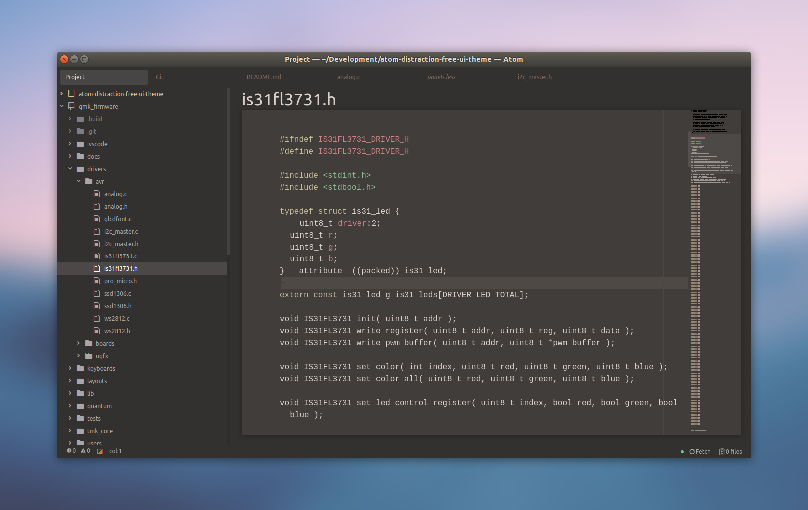

# Distraction free Atom UI Theme

A minimalist UI theme.

Works well with the [distraction free syntax theme](https://atom.io/themes/atom-distraction-free-syntax).

## Goal

This UI theme highlights only the main parts of the editor (the active tab and the text editor), leaving the other elements darker or hidden.

## Details

 - the tree view is not visible by default, you need to hover it to see its content
 - the pending tabs are faded into the background
 - the active tab is brighter and displayed with a subtle background
 - the active text editor tab is bigger and moved on top of the editor
 - many of the borders (panels, tabs, lists) are removed
 - less colors and contrasts

## Recommended custom styles

This custom style configuration do hide some status bar informations.

```
.status-bar {
  encoding-selector-status,
  grammar-selector-status,
  .file-info,
  .github-branch,
  .github-StatusBarTile,
  .line-ending-tile {
    display: none;
  }
}
```

## What it looks like







